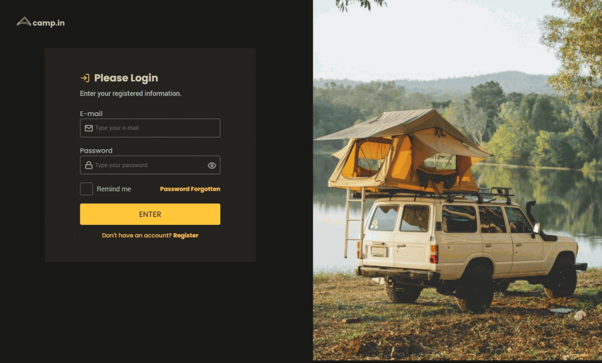

# frontend-loginform
<h2>Challenge frontend design for Login Form</h2>

<h2>Responsive Page</h2>

<strong>:hammer_and_wrench: Project:</strong> Convert figma Layout to Frontend code. Using:

<ul>
  <li> HTML</li>
  <li> CSS</li>
  <li> Sass SCSS</li>
  <li> Media Queries</li>
  <li> Flexbox</li>
  <!-- <li> Grid</li> -->
  <li> Javascript</li>
</ul>

I wrote from scratch all code without any video reference.

In CSS, along with Sass, I'm using colors variables, viewport breakpoints, REM sizes, CSS reset, media queries, flexbox and grid.

<h3>Plus:</h3>

I added Sass to the project to help me on some CSS settings.

I found an issue with the input's <em>default autofill background color</em>, which was originally <em>white</em>, I felt it was too bright for the proposed design so I made a CSS hack to override this color to keep the visual smoother, even if the user selects an <em>autofill</em> value from his browser history. I saw the missing icon on this scenario, but I called it a day and just left it there.

The input <em>autofill</em> also had a white default border so I added a CSS hack to override this to the yellow border request on design.

The design proposed a custom checkbox that currently doesn't have CSS properties to style over, so I added some CSS hacks to create a custom checkbox border, background and checkmark icon to  match the design. Hitting space even makes the checkbox checked or unchecked with the new style on it.

About password's <em>eye behavior</em>, there was no design for the <em>closed eye</em>, so I made a script to still show and hide the password when clicking on the eye icon, but keeping the eye image unchanged, to stick strictly to the figma layout proposed.

At last, I added some accessibility to navigate on the most important elements with tab, and adding a contrasting outline to where was missing it.

<h2>Example Images</h2>

Desktop 

Mobile 

